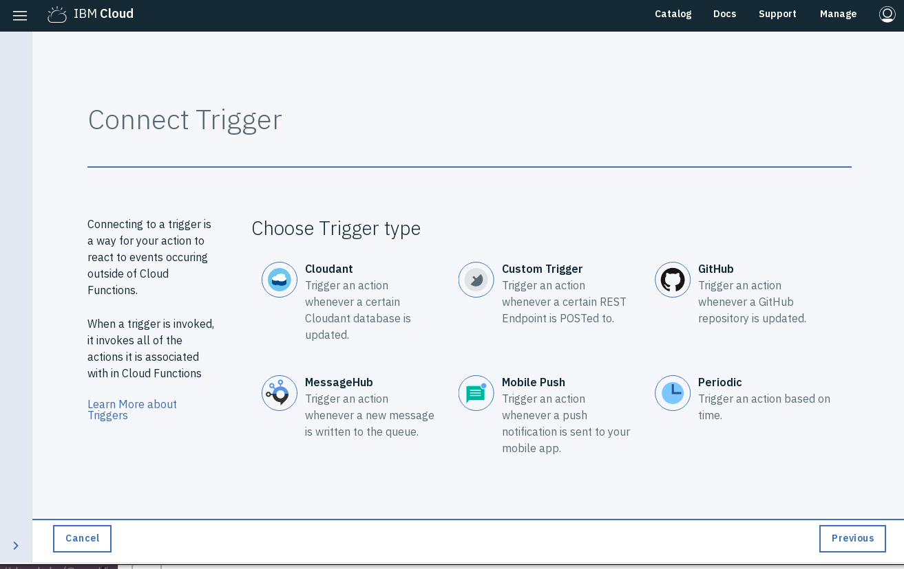
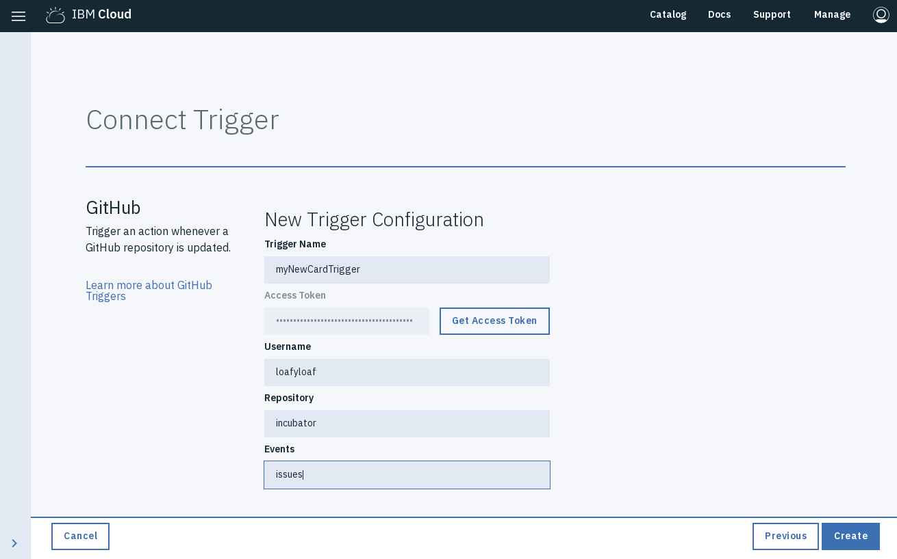
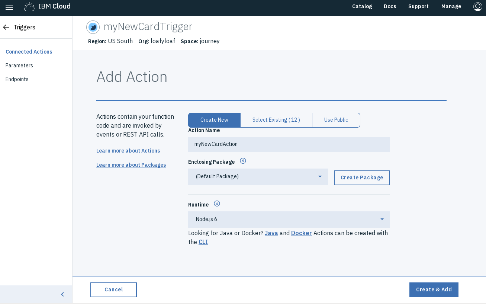
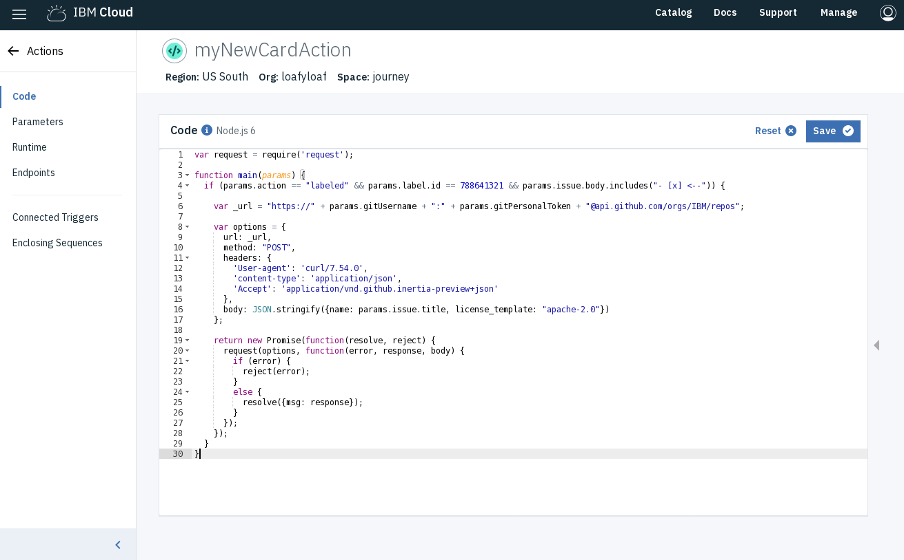

[](https://travis-ci.org/IBM/github-project-automation-with-openwhisk)

# Github Project automation with OpenWhisk

In this Code Pattern, we will automate a few of the administrative tasks asscociated with Github Projects using OpenWhisk, and by extension, Serverless technologies.  We will set up some OpenWhisk actions and triggers and associate them with webhooks generated by the Github API.  The Actions we set up will then send requests back to the Github API to manipulate our Github Project.  Optionally, we will have some of our actions send alerts via Slack.  This pattern builds upon an idea put forth by Anthony Amanse in his [Cloudfunction-github repository](https://github.com/AnthonyAmanse/cloudfunction-github).

When the reader has completed this Code Pattern, they will understand how to:

* Set up an IBM Cloud Function action
* Trigger an IBM Cloud Function with a webhook
* Interact with the Github API


## Flow
1. User sets up OpenWhisk actions
2. Actions are associated with triggers from Github webhooks
3. Interactions with a Github Project create webhooks
4. OpenWisk actions send requests to Github API
5. (Optional) Alerts are sent to Slack API

## Included components
* [OpenWhisk](https://console.ng.bluemix.net/openwhisk): Execute code on demand in a highly scalable, serverless environment.
* [Slack](https://slack.com/): Slack is a cloud-based set of team collaboration tools and services with chat bot integration.

## Featured technology
* [Serverless](https://www.ibm.com/cloud-computing/bluemix/openwhisk): An event-action platform that allows you to execute code in response to an event.

# Watch the Video
[](https://www.youtube.com/watch?v=zvFJFNvrOa8)

# Steps

There are multiple actions/triggers you can set up using the code in the repository.  You can select more than one:

1. [Prerequisites](#1-prerequisites)
2. [Clone the Repo](#2-clone-the-repo)
3. [New Card Creation](#3-new-card-creation)
4. [Send Slack notification](#4-send-slack-notification)
5. [Add new repository](#5-add-new-repository)

### 1. Prerequisites

Since we are using Github Projcects and interacting with them through the Github API, you will need a Github user account and a Personal access token.  If you do not already have one, you sign up for an account [here](https://github.com/join).  Once you have logged in, select the dropdown menu on the far upper right on the Github website, and select 'Settings'.  From your personal settings, towards the bottom on the left hand side you should see a link for 'Developer Settings'.  Select this, and then from the following page select 'Personal access tokens'.  Click the [Generate a personal access token](https://github.com/settings/tokens/new) link and you will have an access token.  Copy this down: we will need it to access the Github API:
```
$ export GIT_TOKEN=[your 40 digit hex code]
```

We will also need to create a Github Project, as the administration of such a Project is what we are trying to automate!  From your Github repository in the web UI, select the Projects tab, and then click 'Create Project'.  We will need the ID that the API associates with that project, so:

```
$ curl -u [yourGithubID]:[yourGithubToken] -H "Accept: application/vnd.github.inertia-preview+json" "https://api.github.com/repos/[yourGithubID]/[yourGithubRepo]/projects"
```

Scroll through this list to find the ID of the Project you just created.  Make note of this.


### 2. Clone the repo

Clone the `Github-Project-Automation-with-OpenWhisk` repository locally. In a terminal, run:

```
$ git clone https://github.com/IBM/Github-Project-Automation-with-OpenWhisk
```
and then go ahead and move into that directory:
```
$ cd Github-Project-Automation-with-OpenWhisk
```

### 3. New Card Creation

Our first task is to automate adding a card to the project whenever a new issue is created.  This does not happen automatically, and if you are looking to track every issue that comes in, dragging each one of them onto the project board can be a monotinous task.  First, we will need to identify the column in which new cards should be created:

```
$ curl -u [yourGithubID]:[yourGithubToken] -H "Accept: application/vnd.github.inertia-preview+json" "https://api.github.com/projects/[yourProjectID]/columns"
```
Find your prefered column, and keep track of it:
```
$ export COLUMN_ID=[yourColumnId]
```

We will be using the IBM Cloud web UI to create our Trigger and Action.  From the Cloud Functions section, select 'Triggers' from the menu on the left, and then click the 'Create' button.  After selecting the 'Create Trigger' option, you should see this screen:



You can see the kinds of Triggers that IBM Cloud Functions can set up for you.  We are, of course, interested in the Github type.  Click it, and you will be promted for a Trigger name (e.g. myNewCardTrigger), your access token that we obtained in the first step, your Github username, and the repository in question.  Alternately, you can click the 'Get Access Token' button, which will have you autentiate against Github and will then fill out you Username and prepopulate the 'Repository' field wiht a list of repositorities to which your Github account has access.  Finally, the events we would like to watch for our tigger are `issues`.



Click 'create' and you are ready to connect an action to your Trigger.  From the following page click 'Add' in the upper right corner.  Then give your Action a name (e.g. myNewCardAction), and click 'Create & Add'



Now that we've connected and created our Action, we had better add some content to it!  Click the name of your recently created Action from the list, and on the following page, copy and paste the contents of [newCard.js](newCard.js).



Click 'Save'.  Any issues now created in your repositry will show up on your project board.

### 4. Send Slack Alert

Another thing that would be handy is to have an alert sent about an issue when certain criteria have been met.  In this example, we will send anotification to a Slack channel when all the checkboxes in the pre populated description of an issue have been filled.  You can specify the content in the description of a new issue by creating a 'docs/ISSUE_TEMPLATE' file in the base of your repository.

You will also need to set up the 'Incoming Webook' app in your instance of Slack.  Once ready, the app page will show you where to send incoming notifications.  Store this URL locally:
```
export SLACK_WEBHOOK=https://hooks.slack.com/services/AAA/BBB/CCC
```

In the previous example we used the IBM Cloud web UI to create our triggers and actions.  This time we will demonstrate how to do the same thing using the IBM Cloud Functions CLI.  Installation instructions for the CLI can be found [here](https://console.bluemix.net/docs/openwhisk/bluemix_cli.html#cloudfunctions_cli)
You have seen that IBM Cloud Functions already has a package for using Github event streams to create Triggers.  When using the CLI, though, we will first need to bind it:

```
$ bx wsk package bind /whisk.system/github myGit \
 --param username [yourGithubID] \
 --param repository [yourGithubRepo] \
 --param accessToken $GIT_TOKEN
```

To create the Trigger, Action, and Rule using the Bluemix CLI:
```
$ bx wsk trigger create myUpdateIssueTrigger --feed myGit/webhook --param events issues
$ bx wsk action create myUpdateIssueAction updateIssue.js --param gitUsername [yourGithubID] --param gitPersonalToken $GIT_TOKEN --param slackWebhook $SLACK_WEBHOOK
$ bx wsk rule create myUpdateIssueRule myUpdateIssueTrigger myUpdateIssueAction
```

### 5. Add new repository

For our final example, we are going to create an action that creates a new repository in the same Github organization in which our Project exists.  We will also set up several additional actions to populate the newly create repository with some files.

We can use the same trigger for multiple actions:

```
$ bx wsk trigger create myAddFilesTrigger --feed myGit/webhook --param events issues
$ bx wsk action create myAddContribAction addFiles/addContrib.js --param gitUsername [yourGithubID] --param gitPersonalToken $GIT_TOKEN
$ bx wsk rule create myAddContribRule myAddFilesTrigger myAddContribAction
$ bx wsk action create myAddMaintainAction addFiles/addMaintain.js --param gitUsername [yourGithubID] --param gitPersonalToken $GIT_TOKEN
$ bx wsk rule create myAddMaintainRule myAddFilesTrigger myAddMaintainAction
$ bx wsk action create myAddReadmeAction addFiles/addReadme.js --param gitUsername [yourGithubID] --param gitPersonalToken $GIT_TOKEN
$ bx wsk rule create myAddReadmeRule myAddFilesTrigger myAddReadmeAction

```


# Links
* [Demo on Youtube](https://www.youtube.com/watch?v=Jxi7U7VOMYg)
* [Slack](https://slack.com/)

# License
[Apache 2.0](LICENSE)
